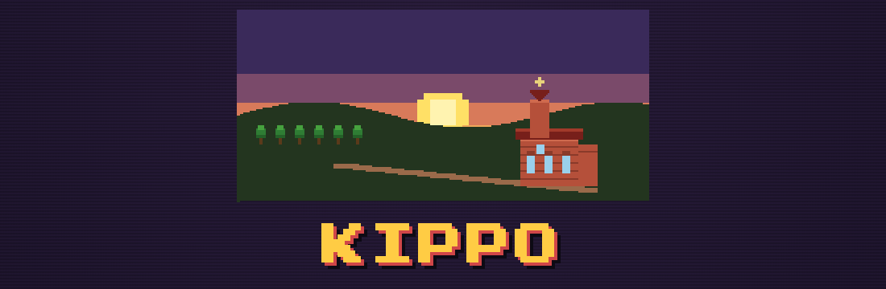

# KIPPO — Die Chronik von Kipshoven

<p align="center">
  
</p>

Pixel-Art-Neuauflage des DOS-Spiels *KIPPO 1.0* (Benjamin Wirtz, 1995) als
Browser-Spiel. Rundenbasierte Wirtschaftssimulation im **Herzogtum Jülich**,
14.–15. Jahrhundert, am Mühlenbach im Dorf **Kipshoven** (heute Stadtteil von
Wegberg).

## Starten

Reines HTML/CSS/JS, kein Build nötig. Entweder die `index.html` direkt im
Browser öffnen — oder über einen kleinen Static-Server (empfohlen, wegen
relativer Pfade):

```sh
cd kippo-web
python3 -m http.server 8123
# Browser: http://localhost:8123
```

## Spielidee

Du erbst als Nachfahre des Franken **Kippo** eine windschiefe Kötterkate.
Wirtschafte über die Generationen hinweg nach oben:

**Kötter → Bauer → Meier → Freiherr (Rittergut) → Burgherr (Wasserburg) →
Stifter (Heiligkreuzkapelle 1492)**

Stiftest du die Kapelle, hast du gewonnen. Geht dein Geschlecht bankrott,
erlischt die Linie des Kippo (Grabstein).

### Jede Runde (= 1 Jahr)
1. **Land** kaufen/verkaufen (Wald, Wiese, Acker) zu schwankenden Preisen
2. **Felder** bestellen: Roggen, Weizen, Gerste, Hafer, **Flachs**
3. **Bauen**: Sägewerk (Wald → Bauholz), Kornmühle (Getreide-Bonus),
   **Ölmühle** (Flachs → Leinöl) und **Webstube** (Flachs → Leinentuch);
   sowie der Rang-Aufstieg
4. **Vieh**: Kühe handeln (jede Kuh braucht 1 Morgen Wiese)
5. **Jahr abschließen**: Ereignis, Ernte, Einnahmen, Zehnt an Jülich, Altern

### Produktionskette Flachs
Flachs allein ist riskant (kaum Gewinn). Erst die **Ölmühle** (Leinöl) und die
**Webstube** (Tuch) machen ihn zur lukrativsten Frucht — angelehnt an die echte
Leinen-/Ölmühlen-Tradition rund um Beeck (Flachsmuseum) und den Mühlenbach.

## Historischer Hintergrund (recherchiert)

- Ortsname von den Frankennamen **Kippo / Kippiko** (um 800)
- **Adam von Kipshoven**, 1316 auf einem Siegel erwähnt — älteste Spur
- **Wasserburg Kipshoven**, später Familie **von Beeck**, ab 1622 **von Agris**
  („Agris-Hof")
- Die Burg wurde vor 1492 aufgegeben; an ihrer Stelle entstand die
  **Heiligkreuzkapelle (1492)**, die noch heute steht (Wandmalereien 1522)
- Region: Herzogtum Jülich, Amt Wassenberg; Mühlen am Mühlenbach lieferten
  Roggenzins (1387 belegt), Holtmühle seit 1397

Quellen: [Kipshoven – Wikipedia](https://de.wikipedia.org/wiki/Kipshoven),
[Burg Kipshoven – EBIDAT](http://www.ms-visucom.de/cgi-bin/ebidat.pl?id=3887),
[Stadt Wegberg – Stadtgeschichte](https://www.wegberg.de/tourismus-kultur/stadtgeschichte/),
[Von Rittergut zu Rittergut (NPR Meinweg)](http://www.npr-meinweg.eu/download/1/Von_Rittergut_zu_Rittergut_D.pdf).

## Dateien
| Datei | Inhalt |
|---|---|
| `index.html` | Aufbau: Titel, Dashboard (Tabs), Overlays |
| `style.css` | Retro-Pixel-Optik (C64/NES), CRT-Scanlines, Press-Start-2P-Font |
| `scene.js` | Pixel-Art-Renderer (Hof-Szene, Gebäude je Rang, Titel, Grabstein) |
| `game.js` | Spiellogik: Zustand, Markt, Ernte, Ereignisse, Erbfolge, Sieg/Niederlage |

## Mögliche Erweiterungen
- Balance schärfen (frühe Jahre spannender, Kühe weniger stark)
- Speicherstand (localStorage)
- Soundeffekte / Chiptune
- Mehr Ereignisse, Nachbardörfer (Gripekoven, Moorshoven, Beeck), Markt in Wegberg
- Animationen (Mühlrad, Wolken, Tag/Nacht)
